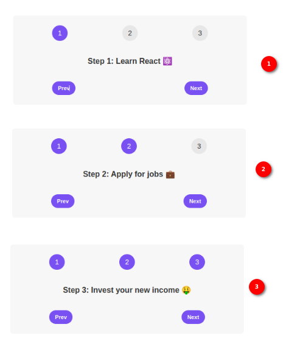
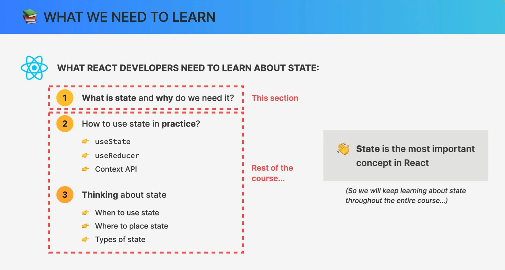
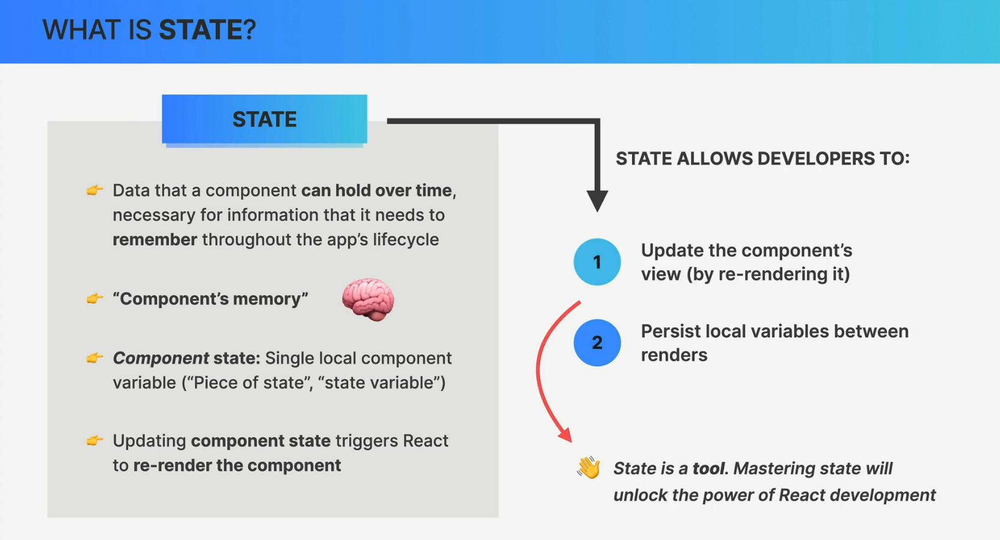
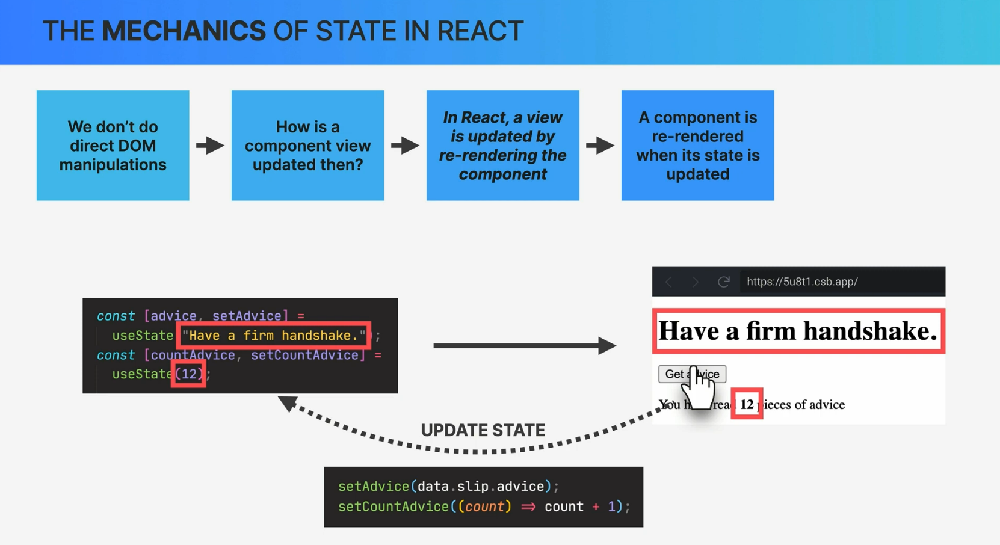
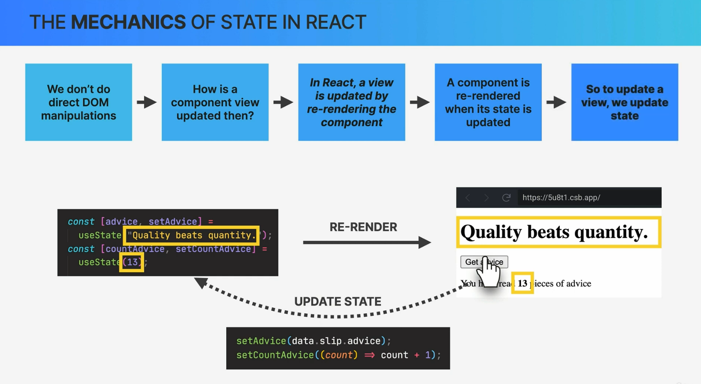
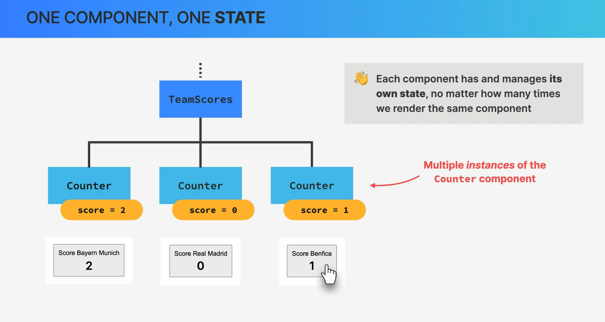
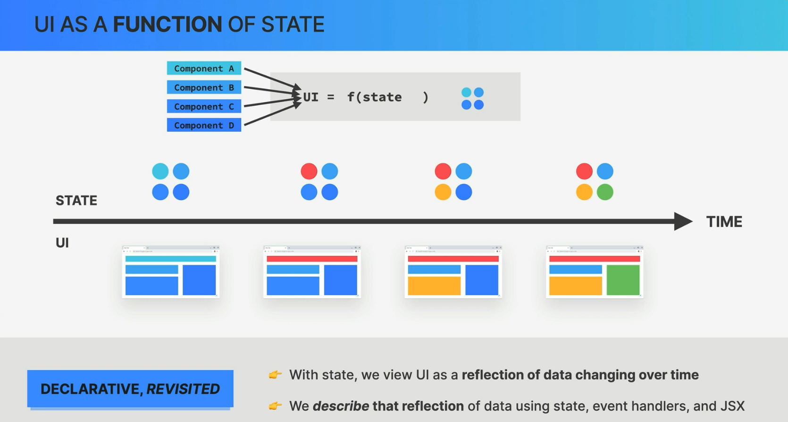
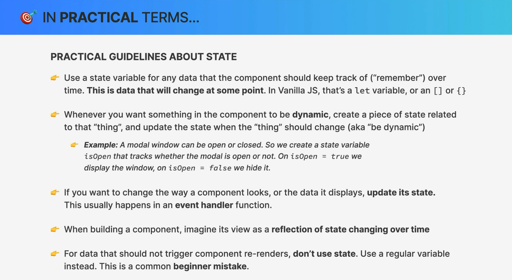
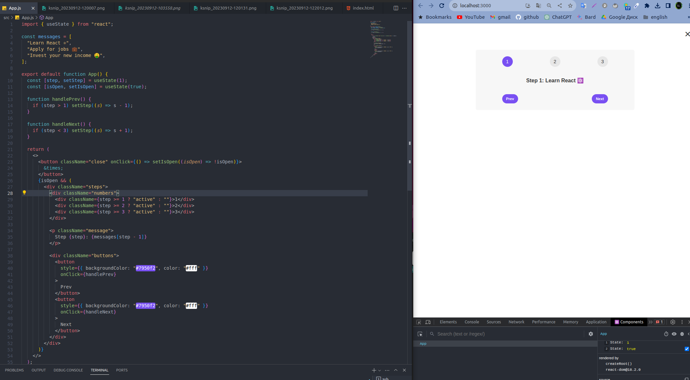

# State in React

### 1. What is State in React?

**State** in React is a JavaScript object used to store data that can change over time and influence a component's rendering and behavior. It represents the dynamic or mutable part of a component. Here's how to use state in React:

- **Initialization**: State is typically initialized in the constructor (for class components) or using the `useState` hook (for functional components).

  - **Class Component Example**:

    ```javascript
    class MyComponent extends React.Component {
      constructor(props) {
        super(props);
        this.state = {
          count: 0,
        };
      }
    }
    ```

  - **Functional Component Example**:

    ```javascript
    import React, { useState } from "react";

    function MyComponent() {
      const [count, setCount] = useState(0);
    }
    ```

- **Accessing State**: You can access state values within your component's render method or functional component body.

- **Updating State**: To update state in a class component, you use the `setState` method. In functional components, you use the state updater function returned by `useState`.

  - **Class Component Example**:

    ```javascript
    this.setState({ count: this.state.count + 1 });
    ```

  - **Functional Component Example**:
    ```javascript
    const incrementCount = () => {
      setCount(count + 1);
    };
    ```

### 2. The Mechanics of State in React:

#### Main Steps:

1. **Initialization**: Create and initialize the state in the constructor (for class components) or using the `useState` hook (for functional components).

2. **Render**: The component's `render` method (or functional component body) uses the state data to generate the JSX that defines the component's UI.

3. **Event Handling**: Define event handlers (e.g., button clicks) that can trigger state updates.

4. **State Update**: When an event occurs, you update the state using `setState` (for class components) or the state updater function (for functional components).

5. **Re-render**: After a state update, React automatically re-renders the component, reflecting the updated state in the UI.

#### Event Handlers:

Event handlers are functions that respond to user interactions (e.g., button clicks, input changes) and trigger state updates. For example, a button click handler might update a counter's value in state.

```javascript
class MyComponent extends React.Component {
  constructor(props) {
    super(props);
    this.state = {
      count: 0,
    };
  }

  handleIncrement = () => {
    this.setState({ count: this.state.count + 1 });
  };

  render() {
    return (
      <div>
        <p>Count: {this.state.count}</p>
        <button onClick={this.handleIncrement}>Increment</button>
      </div>
    );
  }
}
```

### 3. One Component, One State:

In React, it's a common practice to follow the "One Component, One State" principle, which means that a component should manage its own state and not share state data with other components directly. This promotes component modularity and makes it easier to reason about how data flows in your application.

However, there are exceptions to this rule when you need to share state between components. In such cases, you can lift the state up to a common ancestor component and pass it down as props or use state management libraries like Redux or the Context API to handle global state.

Overall, understanding the mechanics of state in React, including initialization, event handling, rendering, and re-rendering, is crucial for building dynamic and interactive user interfaces. It helps you create responsive and maintainable React applications.



















## The `children` prop in React

The `children` prop in React is a special prop that allows you to pass and render child elements or components within a parent component. It provides a way to compose and nest components, making your React code more modular and reusable. Here's a breakdown of the `children` prop:

### What is the `children` prop?

- **What**: The `children` prop is a standard prop in React that represents the content between the opening and closing tags of a component.

- **Where**: It is commonly used in components that act as containers or wrappers for other content, allowing you to include and render child elements or components inside the parent component.

- **Why**: The `children` prop is used to create composite components, which are components that combine and render other components or elements. It helps in building more flexible and reusable UI structures.

### Common Situations When and Where to Use the `children` Prop:

1. **Wrapper Components**: When you want to create a wrapper component that surrounds and styles its children. For example, a `Card` component that wraps content and adds a border and shadow.

   ```jsx
   function Card({ children }) {
     return <div className="card">{children}</div>;
   }

   // Usage
   <Card>
     <h2>Title</h2>
     <p>Content goes here...</p>
   </Card>;
   ```

2. **Layout Components**: In layout components, like a `PageLayout` component, where you want to define the overall page structure and include the main content as children.

   ```jsx
   function PageLayout({ children }) {
     return (
       <div className="page">
         <header>Header goes here</header>
         <main>{children}</main>
         <footer>Footer goes here</footer>
       </div>
     );
   }

   // Usage
   <PageLayout>
     <h1>Welcome to the website</h1>
     <p>Content...</p>
   </PageLayout>;
   ```

3. **Conditional Rendering**: When you want to conditionally render certain parts of your component based on props or state, you can use the `children` prop to include or exclude content.

   ```jsx
   function ConditionalRender({ condition, children }) {
     return condition ? children : null;
   }

   // Usage
   <ConditionalRender condition={true}>
     <p>This will be rendered</p>
   </ConditionalRender>;
   ```

4. **Higher-Order Components (HOCs)**: When building higher-order components that wrap other components to provide additional functionality, you often pass the wrapped component as the `children` prop.

   ```jsx
   function withLogger(WrappedComponent) {
     return function Logger(props) {
       console.log(`Props: `, props);
       return <WrappedComponent {...props} />;
     };
   }

   // Usage
   const EnhancedComponent = withLogger(MyComponent);
   ```

5. **Custom Component Composition**: In your own custom components, you can use the `children` prop to allow users of your component to provide custom content.

   ```jsx
   function MyCustomComponent({ children }) {
     return (
       <div className="custom-component">
         <p>Custom component content:</p>
         {children}
       </div>
     );
   }

   // Usage
   <MyCustomComponent>
     <h2>Custom Title</h2>
     <p>Custom content...</p>
   </MyCustomComponent>;
   ```

The `children` prop is a powerful tool for creating versatile and reusable components in React. It enables you to build component hierarchies and compose complex user interfaces with ease. It's particularly useful when you want to create container components that can wrap and style their content, making your code more organized and maintainable.

# Getting Started with Create React App

This project was bootstrapped with [Create React App](https://github.com/facebook/create-react-app).

## Available Scripts

In the project directory, you can run:

### `npm start`

Runs the app in the development mode.\
Open [http://localhost:3000](http://localhost:3000) to view it in your browser.

The page will reload when you make changes.\
You may also see any lint errors in the console.

### `npm test`

Launches the test runner in the interactive watch mode.\
See the section about [running tests](https://facebook.github.io/create-react-app/docs/running-tests) for more information.

### `npm run build`

Builds the app for production to the `build` folder.\
It correctly bundles React in production mode and optimizes the build for the best performance.

The build is minified and the filenames include the hashes.\
Your app is ready to be deployed!

See the section about [deployment](https://facebook.github.io/create-react-app/docs/deployment) for more information.

### `npm run eject`

**Note: this is a one-way operation. Once you `eject`, you can't go back!**

If you aren't satisfied with the build tool and configuration choices, you can `eject` at any time. This command will remove the single build dependency from your project.

Instead, it will copy all the configuration files and the transitive dependencies (webpack, Babel, ESLint, etc) right into your project so you have full control over them. All of the commands except `eject` will still work, but they will point to the copied scripts so you can tweak them. At this point you're on your own.

You don't have to ever use `eject`. The curated feature set is suitable for small and middle deployments, and you shouldn't feel obligated to use this feature. However we understand that this tool wouldn't be useful if you couldn't customize it when you are ready for it.

## Learn More

You can learn more in the [Create React App documentation](https://facebook.github.io/create-react-app/docs/getting-started).

To learn React, check out the [React documentation](https://reactjs.org/).

### Code Splitting

This section has moved here: [https://facebook.github.io/create-react-app/docs/code-splitting](https://facebook.github.io/create-react-app/docs/code-splitting)

### Analyzing the Bundle Size

This section has moved here: [https://facebook.github.io/create-react-app/docs/analyzing-the-bundle-size](https://facebook.github.io/create-react-app/docs/analyzing-the-bundle-size)

### Making a Progressive Web App

This section has moved here: [https://facebook.github.io/create-react-app/docs/making-a-progressive-web-app](https://facebook.github.io/create-react-app/docs/making-a-progressive-web-app)

### Advanced Configuration

This section has moved here: [https://facebook.github.io/create-react-app/docs/advanced-configuration](https://facebook.github.io/create-react-app/docs/advanced-configuration)

### Deployment

This section has moved here: [https://facebook.github.io/create-react-app/docs/deployment](https://facebook.github.io/create-react-app/docs/deployment)

### `npm run build` fails to minify

This section has moved here: [https://facebook.github.io/create-react-app/docs/troubleshooting#npm-run-build-fails-to-minify](https://facebook.github.io/create-react-app/docs/troubleshooting#npm-run-build-fails-to-minify)
